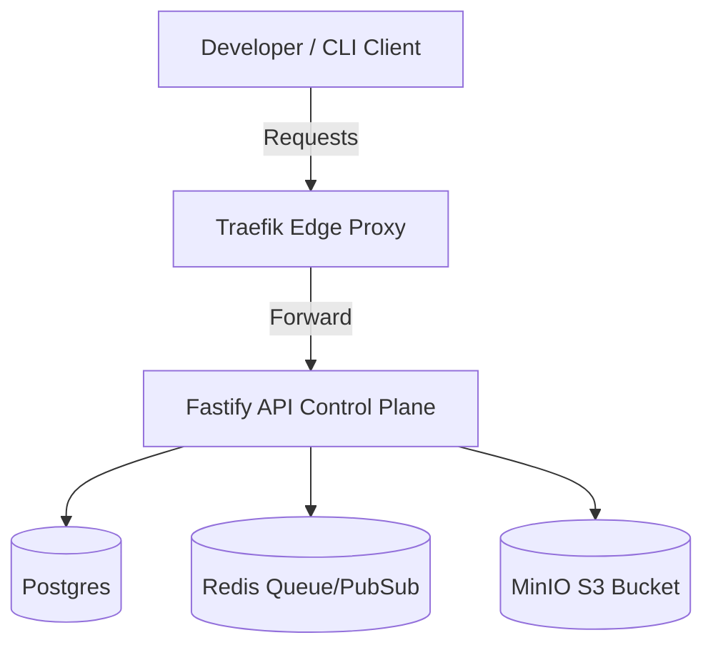

# Portway

Portway is a self-hosted, developer-focused platform for Git-integrated static and dynamic site deployments (similar to Vercel/Netlify, but running on your own infrastructure).

## Architecture Overview



Refer to [ARCHITECTURE.md](docs/ARCHITECTURE.md) for more details.

## Phase 1: Foundation (Current Status)

This phase establishes the monorepo workspace configuration, launches the core infrastructure (PostgreSQL, Redis, MinIO, Traefik) via Docker Compose, sets up the DB schema and migrations, and initializes the API control plane skeleton with health check endpoints, structured logging, and graceful shutdown handling.

### Prerequisites

- **Docker & Docker Compose** (Docker v20+ / Compose v2+)
- **Node.js** (v20+ or v22+)

### Local Development Setup & How to Run

1. **Clone the Repository** (If you haven't already):
   ```bash
   git clone https://github.com/KuldeepLakhera9/portway.git
   cd portway
   ```

2. **Install Dependencies**:
   ```bash
   npm install
   ```

3. **Start the Infrastructure Containers**:
   ```bash
   docker compose -f infra/docker-compose.yml up -d
   ```
   This will spin up PostgreSQL, Redis, MinIO, and Traefik in the background.

4. **Verify Infrastructure Health**:
   ```bash
   docker compose -f infra/docker-compose.yml ps
   ```

5. **Start the API Server**:
   ```bash
   npm run dev:api
   ```
   This automatically runs migrations against the local Postgres database and spins up the Fastify server.

### Local Service Ports & URLs

- **API Control Plane**: `http://localhost:3010`
- **Swagger / OpenAPI Documentation**: `http://localhost:3010/docs`
- **Liveness Check**: `http://localhost:3010/healthz`
- **Readiness Check**: `http://localhost:3010/readyz`
- **Traefik Dashboard**: `http://localhost:8080`
- **MinIO Dashboard Console**: `http://localhost:9001` (Credentials: `portway-admin` / `portway-admin-pass`)
- **PostgreSQL**: `localhost:5433` (Credentials: `portway` / `portway-secure-pass`)
- **Redis**: `localhost:6379`
