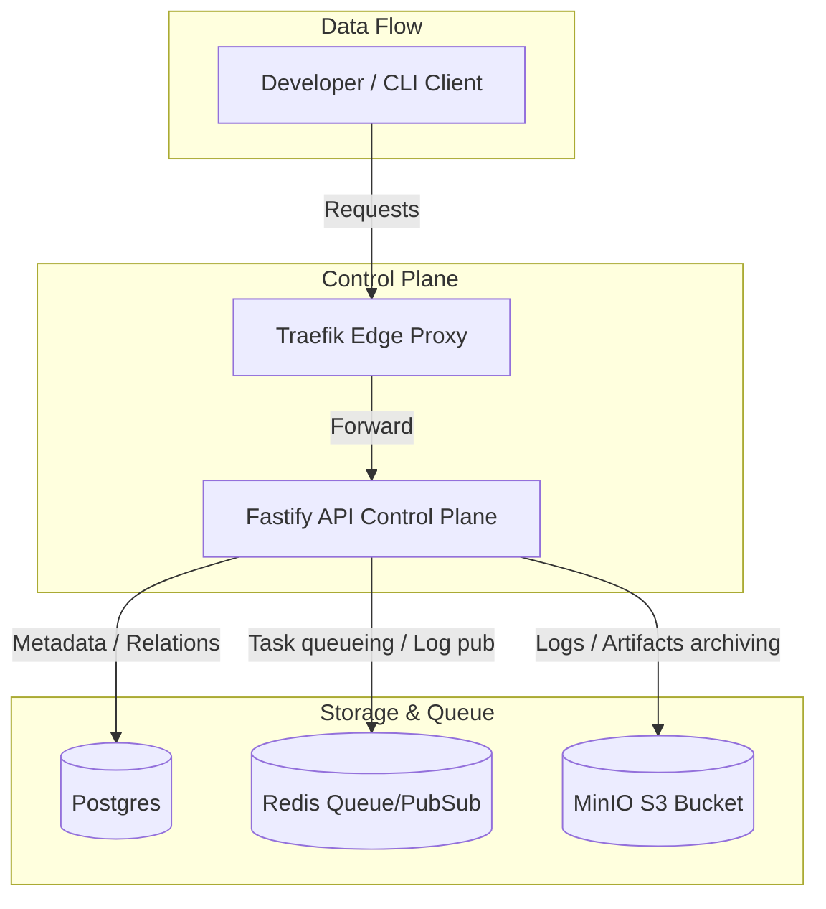

# Portway Architecture

This document describes the high-level architecture of Portway.

## Service Components

1. **Traefik Proxy**: Entrypoint for all external traffic. Inspects Host headers and routes request appropriately (e.g. `/api` to the Control Plane, deployment domains to static storage or running build containers).
2. **API Control Plane**: Fastify HTTP server responsible for project registration, environment variables configuration, OAuth login flow, and serving the developer dashboard.
3. **Queue / Bus (Redis)**: Runs asynchronous job routing (BullMQ) for triggering build workloads and streaming real-time logs via Pub/Sub.
4. **Relational Database (Postgres)**: Holds structured records for users, teams, memberships, projects, environments, and domain verification txt checks.
5. **Object Storage (MinIO / S3)**: Hosts static website directories and archives old build logs.
